# FastWave
> Cross-Platform Wave Viewer 

---

<p align="center">Default state - Dark (new design)</p>
<p align="center">
  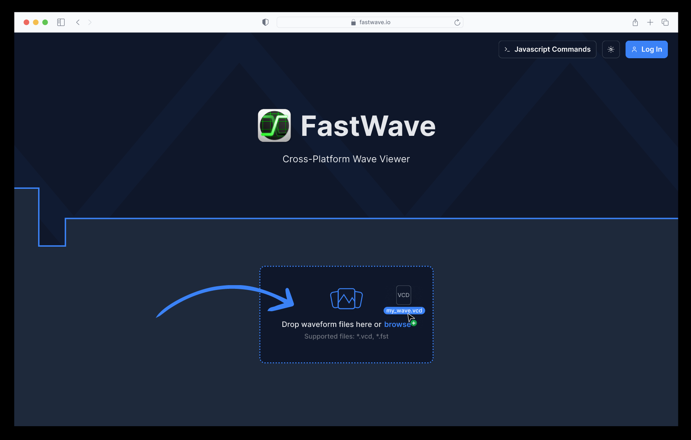
</p>

<p align="center">Loaded files - Dark (new design)</p>
<p align="center">
  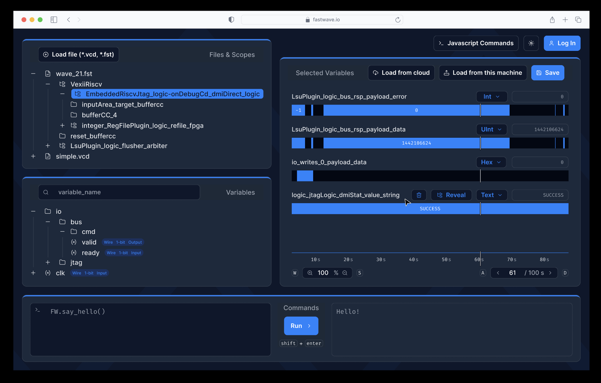
</p>

<p align="center">Default state - Light (new design)</p>
<p align="center">
  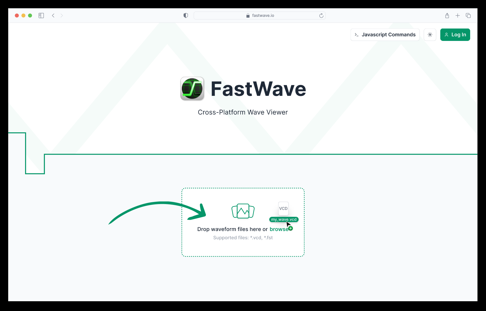
</p>

<p align="center">Loaded files - Light (new design)</p>
<p align="center">
  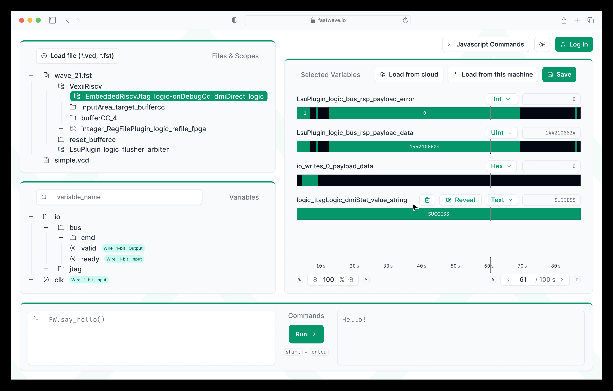
</p>


<p align="center">Browser (Firefox)</p>
<p align="center">
  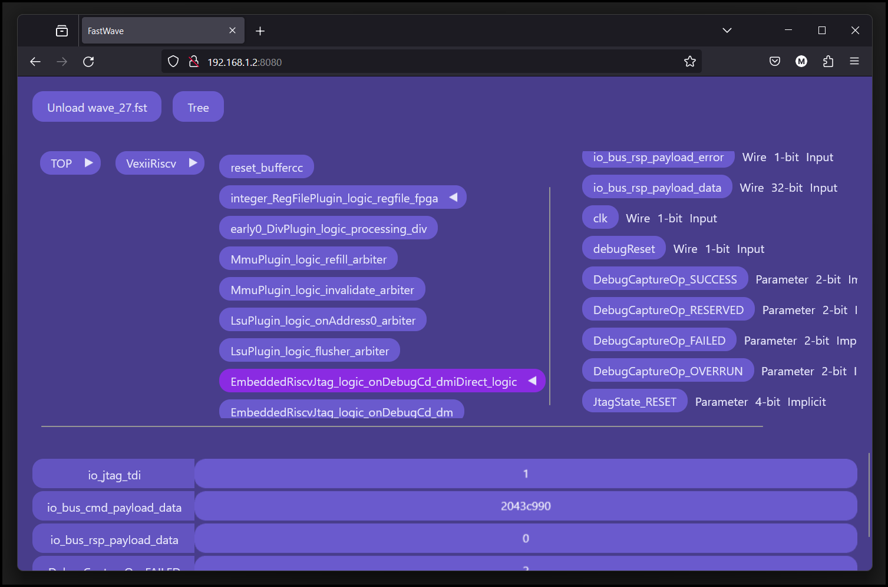
</p>

<p align="center">Desktop, miller columns and tree</p>
<p align="center">
  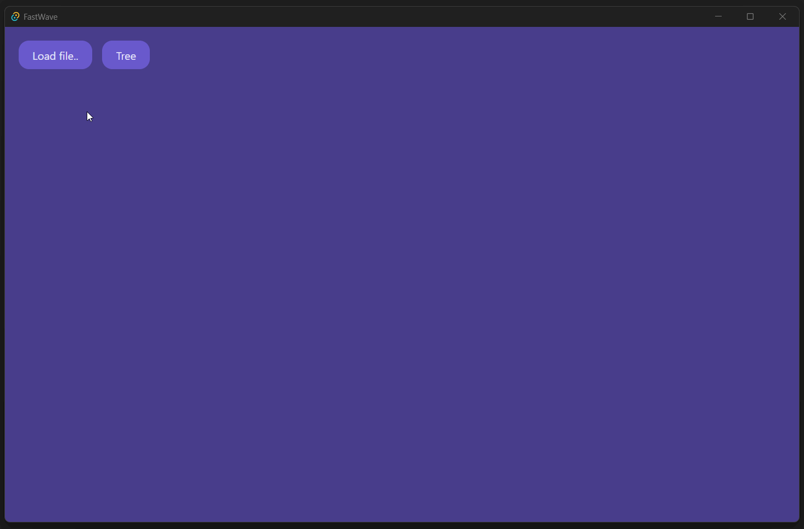
</p>

<p align="center">Zoom, pan and basic number formats</p>
<p align="center">
  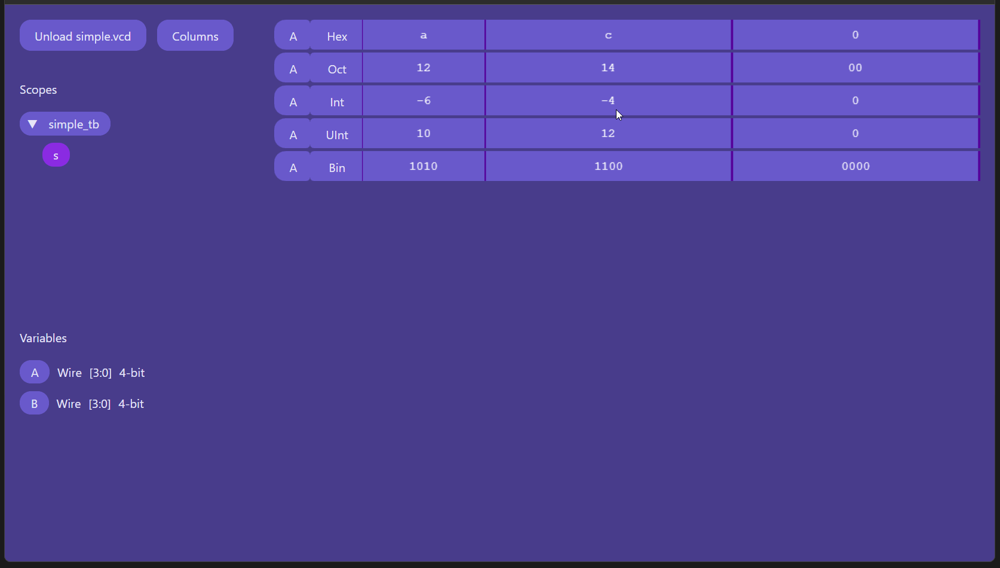
</p>

<p align="center">Zoom and all formats</p>
<p align="center">
  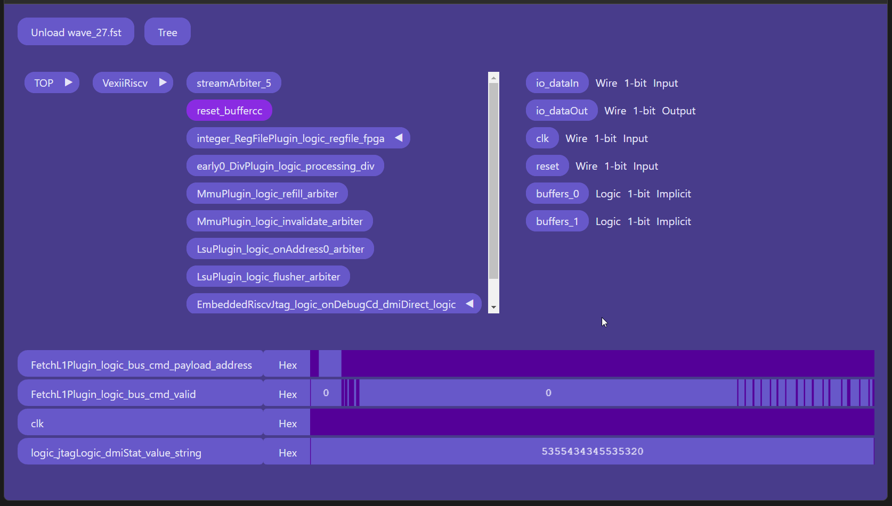
</p>

<p align="center">Javascript commands</p>
<p align="center">
  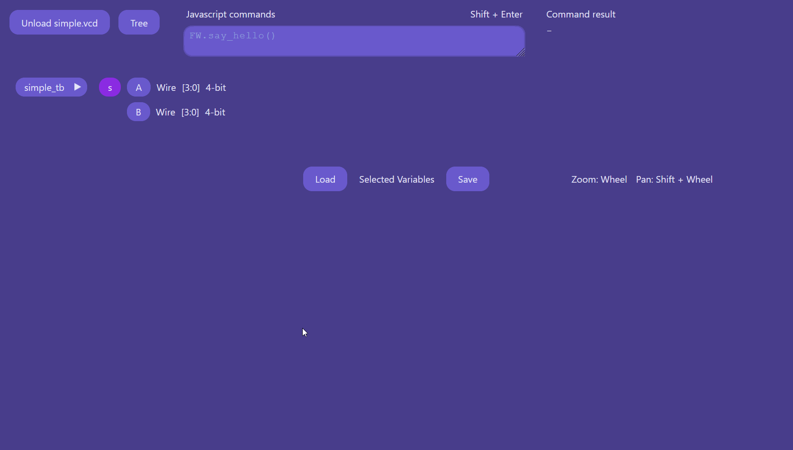
</p>

<p align="center">Load and save selected variables</p>
<p align="center">
  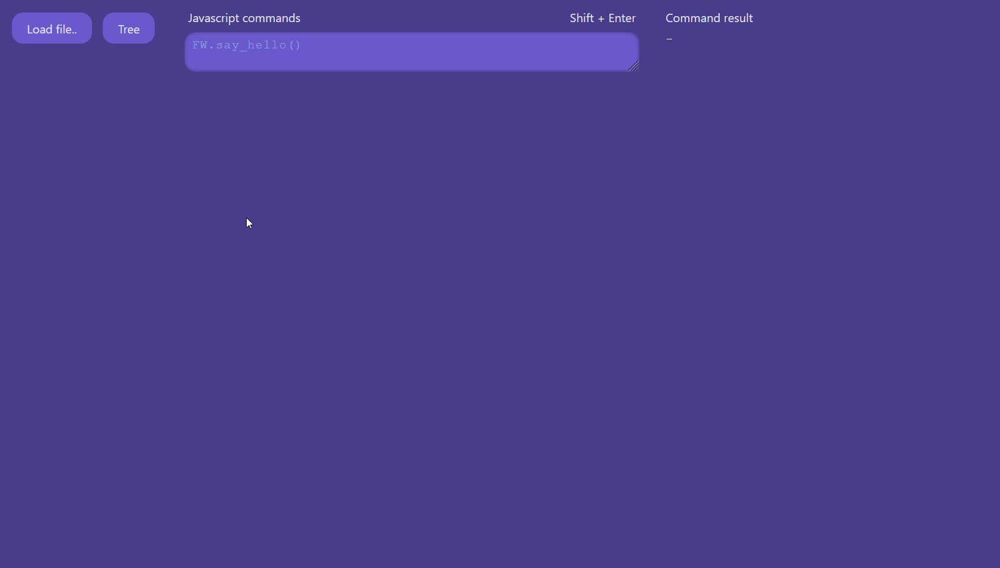
</p>

<p align="center">Decoders (Plugins) Demo</p> 
<p align="center">
  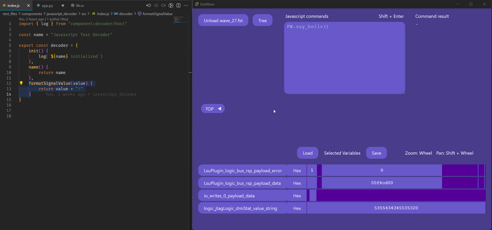
</p>

<p align="center">Decoder Interface</p>
<p align="center">
  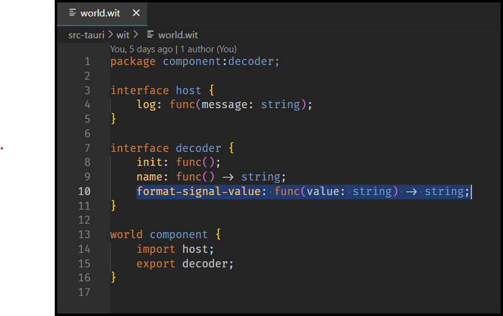
</p>

<p align="center">Diagrams - open, edit, JS API</p>
<p align="center">
  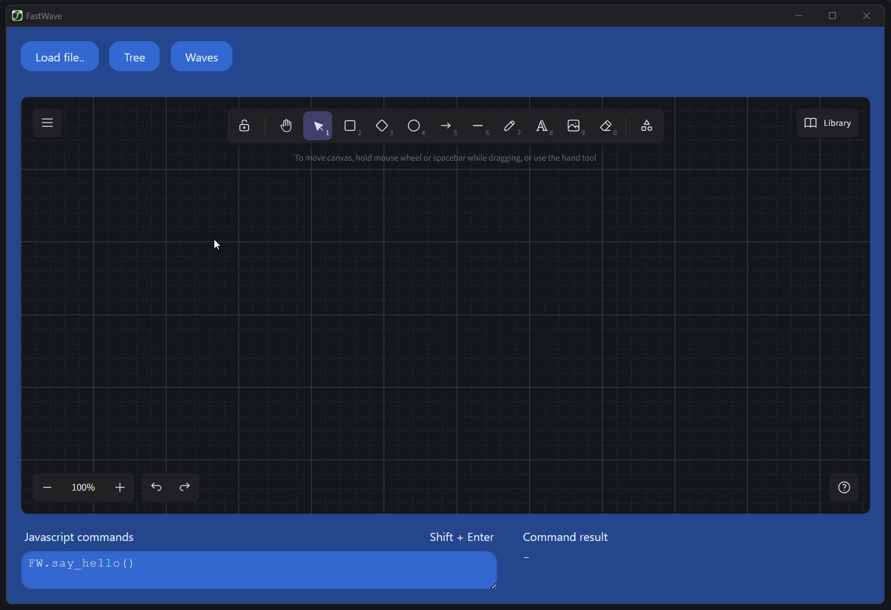
</p>

<p align="center">Diagram Connector Demo</p> 
<p align="center">
  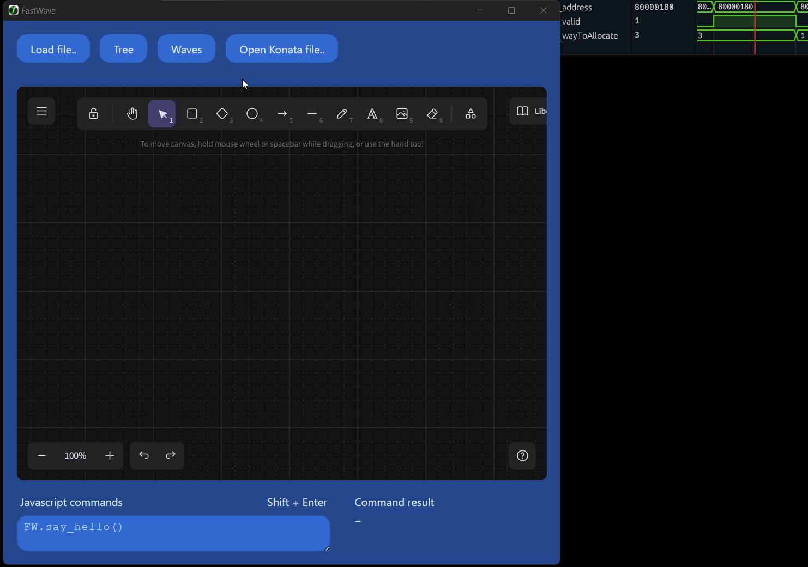
</p>

<p align="center">Diagram Connector Code snippet</p>
<p align="center">
  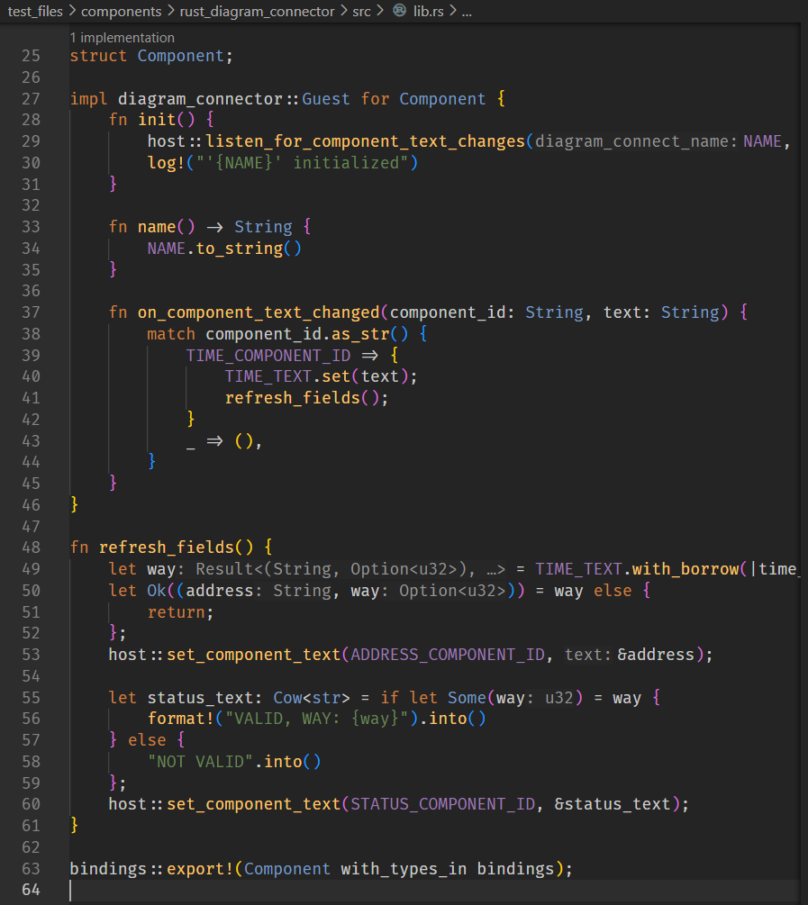
</p>

---

### Installation (desktop version):

Download and install from [Releases](https://github.com/JoyOfHardware/FastWave2.0/releases/latest)

---

### Requirements to build from source:

1. Install [Rust](https://www.rust-lang.org/tools/install)
2. Install [Node.js](https://nodejs.org/)
3. `cargo install cargo-make`
4. `makers install`

___

### Start the desktop version:

1. `makers start`

Troubleshooting:
- In case of Tauri compilation errors, install system dependencies: https://beta.tauri.app/guides/prerequisites/

- Possible Tauri runtime errors in terminal of VSCode installed from Linux Snap package manager:
    ```
    Failed to load module "colorreload-gtk-module"

    /usr/lib/x86_64-linux-gnu/webkit2gtk-4.1/WebKitNetworkProcess: symbol lookup error: /snap/core20/current/lib/x86_64-linux-gnu/libpthread.so.0: undefined symbol: __libc_pthread_init, version GLIBC_PRIVATE
    ```
    Fix it by installing VSCode directly from official `.deb` bundle or try to unset multiple env variables - more info in https://stackoverflow.com/questions/75921414/java-symbol-lookup-error-snap-core20-current-lib-x86-64-linux-gnu-libpthread

---

### Production build of the desktop version:

1. `makers bundle`
2. Runnable executable is in `target/release`
3. Installable bundles specific for the platform are in `target/release/bundle`

---

### Start in a browser:

1. `makers start_browser`
2. Ctrl + Click the server URL mentioned in the terminal log 

---

### Start in a browser in the release mode:

1. `makers start_browser_release`
2. Ctrl + Click the server URL mentioned in the terminal log 

---

### Steps before pushing:

1. `makers format`

---

### Rebuild Decoders:

See `test_files/components/[language]_decoder/README.md`

---

### Test files

See the folder `test_files`.

---

# Sponsors

<p align="center">
    <a href="https://NLnet.nl">
        
    </a>
</p>
